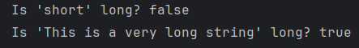
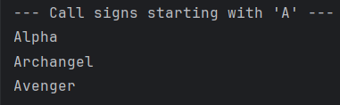
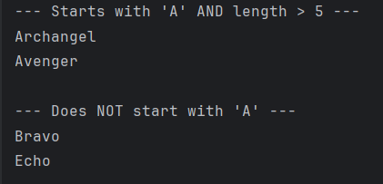

# Name: Francis Aldrin Belmes
# Lab: Introduction to Java Lambdas and Predicates
# Objective:
To understand the purpose of lambda expressions and learn how to write and use simple Predicates to test data.
***
## Exercise 1: The "New Way" - A Simple Lambda Expression
### Prediction:

### Observation:

## Exercise 2: Using Predicates to Filter a List
### Prediction:

### Observation:

## Exercise 3: Chaining Predicates (and, negate)
### Prediction:

### Observation:

